<h1 align="center"><strong>Chrome Extension + Stripe Explained<br>Apps Script backend, OAuth, webhooks, and promo flows</strong></h1>

<p align="center">
  <a href="https://youtu.be/3dDX6E9vnis">
    
  </a>
</p>

<p align="center">
  <a href="https://youtu.be/3dDX6E9vnis">Chrome Extension + Stripe Explained | Apps Script backend, OAuth, webhooks, and promo flows</a>
</p>

## 🎬 Introduction

This repository provides a template for building a Chrome extension with a robust, Firebase-free architecture for user authentication and managing one-time Stripe payments.

The template uses:
*   **Google Chrome Identity API** for seamless Google Sign-In.
*   **Stripe Checkout** for payments.
*   **Google Apps Script** as a secure, serverless backend.
*   **Google Sheets** as a lightweight payment ledger ("database").
*   **Webpack** for frontend bundling.

## 🌟 Features

*   **Google Identity Integration:** Securely authenticate users via their Chrome browser profile without requiring a password.
*   **Stripe Checkout:** Handle one-time payments for premium access.
*   **Dynamic Promotions:** Set up time-limited discounts and free access periods managed directly in a Google Sheet.
*   **Efficient Caching:** Use Google Apps Script's `CacheService` for fast user status verification and promotion checks.
*   **Idempotent Webhooks:** Prevent duplicate payment processing with secure webhook handling.
*   **Clean Architecture:** Separation of concerns between frontend, backend, and styling for easy maintenance.

## 🚀 Installation & Setup

### 1. Clone and Install Dependencies

```bash
git clone [repository-url]
cd [repository-name]
npm install
```

### 2. Google Sheets Setup
Create a new Google Sheet (e.g., "My App Backend") with the following tabs and headers:
- **Payments:** Email, PurchaseDate, StripeEventID
- **Promotions:** ActiveUntilDate, PromoType, StripePromoCodeID, PromoMessage, ButtonText, SalePriceText, OriginalPriceText
- **Error Logs:** Timestamp, FunctionName, ErrorMessage

### 3. Google Apps Script Configuration
1. In your Google Sheet, go to **Extensions > Apps Script**.
2. Copy the provided `Code.gs` from your backend and paste it into the editor.
3. Go to **Project Settings** (gear icon) > **Script Properties**. Add:
   - `STRIPE_SECRET_KEY` (Your Stripe secret key)
   - `WEBHOOK_SECRET_KEY` (A unique UUID for webhook authentication)
   - `DEFAULT_PRICE_ID` (Your standard Stripe Price ID)
4. Deploy as Web App:
   - Click **Deploy > New deployment**.
   - Type: Web app. Execute as: Me. Who has access: Anyone.
   - Copy the Web app URL.

### 4. Stripe Webhook Configuration
1. In your Stripe Dashboard, go to **Developers > Webhooks**.
2. Click **Add endpoint**.
3. Endpoint URL: Paste your Web app URL and append the `WEBHOOK_SECRET_KEY` as a query parameter:
   ```
   YOUR_APPS_SCRIPT_URL?webhook_secret=YOUR_UUID
   ```
4. Events to send: `checkout.session.completed`

### 5. Frontend Configuration
1. Create a `.env` file in the project root. Add `.env` to `.gitignore`.
2. Add your Apps Script URL:
   ```env
   VERIFICATION_ENDPOINT="YOUR_APPS_SCRIPT_URL"
   ```
3. Update your `manifest.json` with your Google Cloud OAuth Client ID (Type: Chrome App) and `identity.email` permission.

### 6. Build and Run
```bash
npm run build
```
Load the `dist` folder into Chrome (`chrome://extensions`, Developer mode).

## 💡 Architecture & Technical Flow

The core of this template is a robust authentication and payment verification flow:

### 1. The Authentication and Status Check (Client to Backend)

**Initial Load:** When the extension is opened, `main.js` immediately attempts a silent authentication via `chrome.identity.getAuthToken({ interactive: false })`.

**Auth Token Retrieval:**
- If successful, the client gets the user's Google Auth Token and Email (`chrome.identity.getProfileUserInfo`).
- If unsuccessful (user not signed in), the client renders a "Sign In" button, waiting for the user to initiate the interactive flow.

**Status Verification (`action: verify`):**
- The client sends a POST request to the Google Apps Script endpoint (`VERIFICATION_ENDPOINT`) with the user's Token.
- **Backend (`doPost`):** The script validates the token by calling Google's tokeninfo endpoint (`verifyGoogleToken`). This ensures the token is valid and returns the user's verified email.
- **Payment Check (`findEmailInSheet`):** The script checks the Payments sheet (via the optimized TextFinder or cached user list) for the user's email.
- **Promotion Check (`getActivePromotion`):** The script checks the Promotions sheet (via cache or sheet read) for active promotions.
- **Response:** The script returns a unified status object:
  - `{ status: 'paid' }`
  - `{ status: 'free_promo', promoData: {...} }`
  - `{ status: 'not_premium', promoData: {...} }`

**UI Rendering:** The client receives the status and renders the appropriate UI (Premium label, free promo message, discount offer, or standard payment button).

### 2. The Payment Initiation Flow

**User Clicks Payment Button:** The client calls `handlePaymentRequest` and then fetch POSTs a request (`action: 'createCheckout'`) to the backend.

**Backend Creates Session (`handleCreateCheckout`):**
- The script verifies the user's token again.
- It retrieves the active promotion data to determine if a discount should be applied.
- It makes a fetch call to the Stripe API (`https://api.stripe.com/v1/checkout/sessions`), securely using the `STRIPE_SECRET_KEY` to create a checkout session.
- It passes the user's email as `client_reference_id` to link the payment.
- It includes the `discounts` parameter with the `StripePromotionCodeID` if a discount is active.

**Client Redirect:** The script returns the Stripe Checkout URL, and the client redirects the user's browser to the payment page.

### 3. The Webhook Flow (Server to Server)

**Stripe Sends Webhook:** Stripe sends a `checkout.session.completed` POST request to the secret webhook URL.

**Backend Authentication:** The script receives the request. `doPost` checks the URL parameter for the `WEBHOOK_SECRET_KEY`.

**Idempotency Check:** `handleStripeWebhook` checks if the `StripeEventID` is already in the Payments sheet to prevent duplicates.

**Payment Registration:** If new, the script writes the `client_reference_id` (email) and `StripeEventID` to the Google Sheet.

**Cache Invalidation:** The script calls `SCRIPT_CACHE.remove('paid_users_list')` to ensure the list of premium users is reloaded on the next request.

**Response:** The script returns a 200 OK (via `HtmlService.createHtmlOutput`) to Stripe, signaling a successful delivery.


## 🔁 Flowchart

```mermaid
flowchart TD
    %% Component Legend
    subgraph Legend["🏗️ COMPONENT BREAKDOWN"]
        LF["🔵 FRONTEND<br/>Extension UI, Authentication, Local Cache"]
        LB["🟣 BACKEND<br/>Apps Script, Database Ops, Business Logic"]
        LS["🟠 STRIPE<br/>Payment API, Checkout, Webhooks"]
        LC["🟢 CACHE<br/>Caching Operations"]
        LD["🟡 DECISIONS<br/>Conditional Logic"]
        LE["🔴 ERRORS<br/>Error Handling"]
    end

    
    %% Force legend to appear above the main flowchart
    Legend --> A
    A[🚀 User Opens Chrome Extension] --> B{🔐 User Signed In?}
    
    %% FRONTEND: Authentication Flow
    B -->|❌ No| C[📝 Show Sign in with Google Button]
    C --> D[👆 User Clicks Sign In]
    D --> E[🔑 Chrome Identity API<br/>Get Auth Token Interactive]
    E --> F{✅ Sign-in Success?}
    F -->|❌ Failed| G[⚠️ Show Cancellation Message]
    G --> H[🔄 Reset Button State]
    H --> C
    F -->|✅ Success| I[📧 Get OAuth Token & User Email]
    I --> J[💾 Store Token & Reload Extension]
    J --> K[🔄 Extension Restarts with Auth]
    
    %% FRONTEND: Main Flow After Authentication
    B -->|✅ Yes| L[🔍 Silent Token Check<br/>Non-Interactive Mode]
    K --> L
    L --> M[👤 Get User Email from Profile]
    M --> N[⚡ Check Local Cache<br/>Premium Status 24hrs]
    
    %% FRONTEND: Cache Decision
    N --> O{🗄️ Valid Cache Found?}
    O -->|✅ Yes & Paid| P[💎 Display Premium UI]
    O -->|❌ No/Expired/Wrong User| Q[🌐 Call Backend API]
    
    %% BACKEND: Verification Process
    Q --> R[📡 POST to Google Apps Script<br/>Action: verify + OAuth Token]
    R --> S[🔐 Verify Token with Google API]
    S --> T{✅ Token Valid?}
    T -->|❌ Invalid| U[🚫 Return Error Response]
    T -->|✅ Valid| V[📧 Extract User Email]
    V --> W[📋 Get Paid Users List]
    
    %% BACKEND: User Cache Logic
    W --> X{⚡ Users Cached?}
    X -->|✅ Yes| Y[🔍 Check Email in Cache]
    X -->|❌ No| Z[📊 Read Payments Sheet]
    Z --> AA[💾 Cache Users 1 Hour]
    AA --> Y
    
    %% BACKEND: Payment Status Check
    Y --> BB{💳 User Paid?}
    BB -->|✅ Paid| CC[✨ Return Status: PAID]
    BB -->|❌ Not Paid| DD[🎁 Check Active Promotions]
    
    %% BACKEND: Promotion Cache Logic
    DD --> EE{🗄️ Promo Cached?}
    EE -->|✅ Yes| FF[⚡ Return Cached Promo Data]
    EE -->|❌ No| GG[📊 Read Promotions Sheet]
    GG --> HH[📅 Check for Active Promotions]
    HH --> II{🎁 Active Promo Found?}
    II -->|❌ None| JJ[💾 Cache No Promo 10min<br/>Return: NOT_PREMIUM]
    II -->|✅ Found| KK{🏷️ Promo Type?}
    KK -->|🆓 FREE| LL[💾 Cache Free Promo 10min<br/>Return: FREE_PROMO]
    KK -->|💰 DISCOUNT| MM[💾 Cache Discount Promo 10min<br/>Return: NOT_PREMIUM + Promo]
    
    %% FRONTEND: Status Response Handling
    CC --> NN[💾 Cache Paid Status 24hrs]
    LL --> OO[🎉 Grant Premium Access<br/>Show Free Promo Message]
    MM --> PP[💰 Show Discount Promo UI]
    JJ --> QQ[💳 Show Standard Donation Button]
    NN --> P
    
    %% FRONTEND: Payment Initiation
    PP --> RR[👆 User Clicks Promo Button]
    QQ --> SS[👆 User Clicks Enable Premium]
    RR --> TT[⚙️ Handle Payment Request<br/>With Promo Data]
    SS --> TT
    
    %% FRONTEND: Payment Setup
    TT --> UU[⏳ Show Processing State]
    UU --> VV[🔑 Get Auth Token Interactive]
    VV --> WW[📡 POST to Backend<br/>Action: createCheckout]
    
    %% BACKEND: Checkout Creation
    WW --> XX[⚙️ Handle Create Checkout]
    XX --> YY{🏷️ Active Discount?}
    YY -->|✅ Yes| ZZ[🎫 Add Promo Code to Payload]
    YY -->|❌ No| AAA[📝 Standard Payload]
    
    %% STRIPE: Checkout Session
    ZZ --> BBB[💳 STRIPE API<br/>Create Checkout Session]
    AAA --> BBB
    BBB --> CCC{✅ Stripe Response OK?}
    CCC -->|❌ Error| DDD[🚫 Return Error to Frontend]
    CCC -->|✅ Success| EEE[🔗 Return Checkout URL]
    
    %% FRONTEND: Payment Instructions
    EEE --> FFF[📋 Show Payment Instructions Dialog]
    FFF --> GGG[👆 User Clicks Proceed]
    GGG --> HHH[⏳ Set Payment State: pending]
    HHH --> III[🌐 Open Stripe Checkout Tab]
    
    %% STRIPE: Payment Processing
    III --> JJJ[💳 STRIPE CHECKOUT<br/>User Completes Payment]
    
    %% STRIPE → BACKEND: Webhook
    JJJ --> KKK[📨 STRIPE sends Webhook<br/>to Google Apps Script]
    KKK --> LLL[⚙️ Handle Stripe Webhook]
    LLL --> MMM{🔍 Event Already Processed?<br/>Idempotency Check}
    MMM -->|✅ Yes| NNN[✅ Return 200 OK<br/>Skip Processing]
    MMM -->|❌ No| OOO[📧 Extract User Email<br/>from Session Data]
    OOO --> PPP[📊 Add Payment Record to Sheet]
    PPP --> QQQ[🗑️ Clear Paid Users Cache]
    QQQ --> RRR[✅ Return 200 OK to Stripe]
    
    %% FRONTEND: Return Flow
    RRR --> SSS[🔄 User Reopens Extension]
    SSS --> TTT[🔍 Check Premium Status Again]
    TTT --> UUU[📊 Backend Finds User in Sheet]
    UUU --> VVV[✨ Return Status: PAID]
    VVV --> WWW[🗑️ Clear pending Payment State]
    WWW --> P
    
    %% Error Handling
    DDD --> XXX[❌ Show Error Message]
    U --> XXX
    
    %% Final UI States
    P --> YYY[💎 Hide Payment Container<br/>Show Premium Label<br/>Enable Premium Features]
    OO --> ZZZ[🎉 Show Free Promo Message<br/>Enable Premium Features]
    
    %% Component Styling
    classDef frontendNodes fill:#e3f2fd,stroke:#1976d2,stroke-width:3px,color:#000
    classDef backendNodes fill:#f3e5f5,stroke:#7b1fa2,stroke-width:3px,color:#000
    classDef stripeNodes fill:#fff3e0,stroke:#f57c00,stroke-width:3px,color:#000
    classDef errorNodes fill:#ffebee,stroke:#d32f2f,stroke-width:2px,color:#000
    classDef decisionNodes fill:#fff9c4,stroke:#f9a825,stroke-width:3px,color:#000
    classDef cacheNodes fill:#e8f5e8,stroke:#388e3c,stroke-width:2px,color:#000
    classDef legendNodes fill:#f5f5f5,stroke:#757575,stroke-width:1px,color:#000
    
    %% Apply Component Classes
    class A,C,D,E,F,G,H,I,J,K,L,M,N,O,P,Q,OO,PP,QQ,RR,SS,TT,UU,VV,WW,FFF,GGG,HHH,III,SSS,TTT,WWW,XXX,YYY,ZZZ frontendNodes
    class R,S,T,V,W,X,Y,Z,AA,BB,CC,DD,EE,FF,GG,HH,II,JJ,KK,LL,MM,XX,YY,ZZ,AAA,LLL,MMM,OOO,PPP,QQQ,RRR,UUU,VVV backendNodes
    class BBB,CCC,EEE,JJJ,KKK stripeNodes
    class U,DDD errorNodes
    class B,O,T,X,BB,EE,II,KK,YY,CCC,MMM,F decisionNodes
    class NN,AA,LL,MM,JJ,NNN cacheNodes
    class LF,LB,LS,LC,LD,LE legendNodes
```





## 🗂️ Directory Structure

```
chrome-extension-template/
├── dist/                          # Webpack build output (auto-generated, in .gitignore)
├── Google Apps Script             # (Separate from this repo)
│   ├── Code.gs                    # Backend logic
│   └── Google Ext Template Backend.ods   # Backend Google Sheet
├── .env                           # Environment variables (IGNORED)
├── .gitignore                     # Git ignore file
├── background.js                  # Service worker (opens main.html in a new window)
├── icon_sample.png
├── icon_sample_128.png
├── icon_sample_16.png
├── icon_sample_48.png
├── main.html                      # The main extension UI (HTML & CSS)
├── main.js                        # Frontend logic (Chrome Identity, payment flow, UI logic)
├── manifest.json                  # Chrome extension manifest (metadata, permissions, OAuth config)
├── package-lock.json
├── package.json                   # Project dependencies
├── README.md                      # This file
└── webpack.config.js              # Builds the extension for dist/
```
